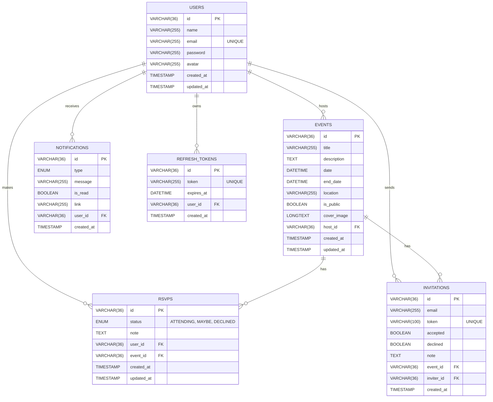

# Eventra Database Schema

This document outlines the raw SQL database schema utilized by the Eventra backend. The architecture is strictly relational and designed for high performance using `mysql2`.

## Entity-Relationship Diagram

## Schema Details
- **Primary Keys**: All IDs are generated using `UUID v4` (VARCHAR 36).
- **Referential Integrity**: All foreign keys utilize `ON DELETE CASCADE` to prevent orphaned records when users or events are deleted.
- **Constraints**: 
  - `RSVPS` has a `UNIQUE KEY (user_id, event_id)` to ensure a user can only RSVP to a specific event once.
  - Emails in `USERS` and tokens in `INVITATIONS` / `REFRESH_TOKENS` are constrained to be strictly `UNIQUE`.
